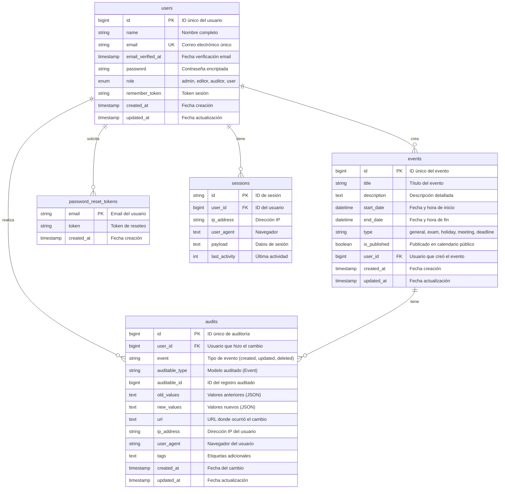

# Diagrama de Base de Datos - Calendario Académico

## Diagrama Entidad-Relación



---

## Descripción de Tablas

### 1. users (Usuarios)
**Propósito**: Almacena información de todos los usuarios del sistema.

| Campo | Tipo | Descripción |
|-------|------|-------------|
| `id` | BIGINT | Identificador único |
| `name` | VARCHAR(255) | Nombre completo del usuario |
| `email` | VARCHAR(255) | Correo electrónico (único) |
| `email_verified_at` | TIMESTAMP | Fecha de verificación del email |
| `password` | VARCHAR(255) | Contraseña encriptada con bcrypt |
| `role` | ENUM | Rol del usuario: admin, editor, auditor, user |
| `remember_token` | VARCHAR(100) | Token para "recordar sesión" |
| `created_at` | TIMESTAMP | Fecha de creación del registro |
| `updated_at` | TIMESTAMP | Fecha de última actualización |

**Índices**:
- PRIMARY KEY: `id`
- UNIQUE: `email`

**Roles Disponibles**:
- `admin`: Acceso completo al sistema
- `editor`: Crear y editar eventos
- `auditor`: Ver historial de cambios
- `user`: Solo acceso al calendario público

---

### 2. events (Eventos)
**Propósito**: Almacena todos los eventos del calendario académico.

| Campo | Tipo | Descripción |
|-------|------|-------------|
| `id` | BIGINT | Identificador único |
| `title` | VARCHAR(255) | Título del evento |
| `description` | TEXT | Descripción detallada (opcional) |
| `start_date` | DATETIME | Fecha y hora de inicio |
| `end_date` | DATETIME | Fecha y hora de finalización |
| `type` | VARCHAR(255) | Tipo de evento |
| `is_published` | BOOLEAN | Si está visible en calendario público |
| `user_id` | BIGINT | ID del usuario creador |
| `created_at` | TIMESTAMP | Fecha de creación |
| `updated_at` | TIMESTAMP | Fecha de última actualización |

**Índices**:
- PRIMARY KEY: `id`
- FOREIGN KEY: `user_id` → `users(id)` ON DELETE CASCADE
- INDEX: `start_date`, `is_published`

**Tipos de Eventos**:
- `general`: Eventos generales
- `exam`: Exámenes
- `holiday`: Vacaciones/Días festivos
- `meeting`: Reuniones
- `deadline`: Fechas límite

---

### 3. audits (Auditorías)
**Propósito**: Registra todos los cambios realizados a los eventos.

| Campo | Tipo | Descripción |
|-------|------|-------------|
| `id` | BIGINT | Identificador único |
| `user_id` | BIGINT | Usuario que realizó el cambio |
| `event` | VARCHAR(255) | Tipo de acción (created, updated, deleted) |
| `auditable_type` | VARCHAR(255) | Clase del modelo (Event) |
| `auditable_id` | BIGINT | ID del evento modificado |
| `old_values` | TEXT | Valores anteriores en JSON |
| `new_values` | TEXT | Valores nuevos en JSON |
| `url` | TEXT | URL donde ocurrió el cambio |
| `ip_address` | VARCHAR(45) | IP del usuario |
| `user_agent` | TEXT | Navegador utilizado |
| `tags` | TEXT | Etiquetas adicionales |
| `created_at` | TIMESTAMP | Fecha del cambio |
| `updated_at` | TIMESTAMP | Fecha de actualización |

**Índices**:
- PRIMARY KEY: `id`
- FOREIGN KEY: `user_id` → `users(id)` ON DELETE SET NULL
- INDEX: `auditable_type`, `auditable_id`, `user_id`

---

### 4. password_reset_tokens
**Propósito**: Almacena tokens para reseteo de contraseñas.

| Campo | Tipo | Descripción |
|-------|------|-------------|
| `email` | VARCHAR(255) | Email del usuario |
| `token` | VARCHAR(255) | Token de reseteo |
| `created_at` | TIMESTAMP | Fecha de creación |

**Índices**:
- PRIMARY KEY: `email`

---

### 5. sessions
**Propósito**: Gestiona las sesiones activas de usuarios.

| Campo | Tipo | Descripción |
|-------|------|-------------|
| `id` | VARCHAR(255) | ID de sesión |
| `user_id` | BIGINT | ID del usuario (nullable) |
| `ip_address` | VARCHAR(45) | Dirección IP |
| `user_agent` | TEXT | Información del navegador |
| `payload` | TEXT | Datos de sesión |
| `last_activity` | INTEGER | Timestamp última actividad |

**Índices**:
- PRIMARY KEY: `id`
- INDEX: `user_id`, `last_activity`

---

## Relaciones

### users → events (1:N)
- Un usuario puede crear múltiples eventos
- Cada evento pertenece a un usuario
- Relación: `users.id` ← `events.user_id`
- Eliminación en cascada: Si se elimina un usuario, se eliminan sus eventos

### users → audits (1:N)
- Un usuario puede realizar múltiples cambios
- Cada auditoría registra quién hizo el cambio
- Relación: `users.id` ← `audits.user_id`
- Eliminación: Si se elimina un usuario, `user_id` se establece en NULL

### events → audits (1:N)
- Un evento puede tener múltiples auditorías
- Cada auditoría pertenece a un evento
- Relación: `events.id` ← `audits.auditable_id`
- Se registra automáticamente al crear, actualizar o eliminar

---

## Diagrama Visual Simplificado

```
┌─────────────────┐
│     USERS       │
│─────────────────│
│ id (PK)         │
│ name            │
│ email (UK)      │
│ password        │
│ role (ENUM)     │◄─────────┐
└─────────────────┘          │
         │                   │
         │ crea              │ realiza
         │                   │
         ▼                   │
┌─────────────────┐          │
│     EVENTS      │          │
│─────────────────│          │
│ id (PK)         │          │
│ title           │          │
│ description     │          │
│ start_date      │          │
│ end_date        │          │
│ type            │          │
│ is_published    │          │
│ user_id (FK)    │──────────┤
└─────────────────┘          │
         │                   │
         │ tiene             │
         │                   │
         ▼                   │
┌─────────────────┐          │
│     AUDITS      │          │
│─────────────────│          │
│ id (PK)         │          │
│ user_id (FK)    │──────────┘
│ event           │
│ auditable_type  │
│ auditable_id    │
│ old_values      │
│ new_values      │
│ ip_address      │
└─────────────────┘
```

---

## Consultas SQL Comunes

### Obtener eventos con su creador
```sql
SELECT 
    e.id,
    e.title,
    e.start_date,
    e.end_date,
    e.type,
    e.is_published,
    u.name as created_by
FROM events e
INNER JOIN users u ON e.user_id = u.id
ORDER BY e.start_date DESC;
```

### Obtener historial de cambios de un evento
```sql
SELECT 
    a.id,
    a.event,
    a.created_at,
    u.name as changed_by,
    a.old_values,
    a.new_values
FROM audits a
LEFT JOIN users u ON a.user_id = u.id
WHERE a.auditable_type = 'App\\Models\\Event'
  AND a.auditable_id = 1
ORDER BY a.created_at DESC;
```

### Contar eventos por tipo
```sql
SELECT 
    type,
    COUNT(*) as total,
    SUM(CASE WHEN is_published = 1 THEN 1 ELSE 0 END) as published
FROM events
GROUP BY type;
```

### Usuarios por rol
```sql
SELECT 
    role,
    COUNT(*) as total
FROM users
GROUP BY role;
```

---

## Notas de Diseño

> [!IMPORTANT]
> **Auditoría Automática**: Todos los cambios en la tabla `events` se registran automáticamente en `audits` gracias al paquete Laravel Auditing.

> [!NOTE]
> **Soft Deletes**: Actualmente no se usa soft deletes. Los eventos eliminados se borran permanentemente pero quedan registrados en auditorías.

> [!TIP]
> **Índices**: Las columnas `start_date` y `is_published` tienen índices para optimizar consultas del calendario público.

---

## Estadísticas de la Base de Datos

**Total de Tablas**: 5
- 2 tablas principales (users, events)
- 1 tabla de auditoría (audits)
- 2 tablas del sistema (password_reset_tokens, sessions)

**Total de Relaciones**: 3
- users → events (1:N)
- users → audits (1:N)
- events → audits (1:N)

**Campos con Índices**: 8
- Primary Keys: 5
- Foreign Keys: 3
- Unique Keys: 1
- Regular Indexes: 4
